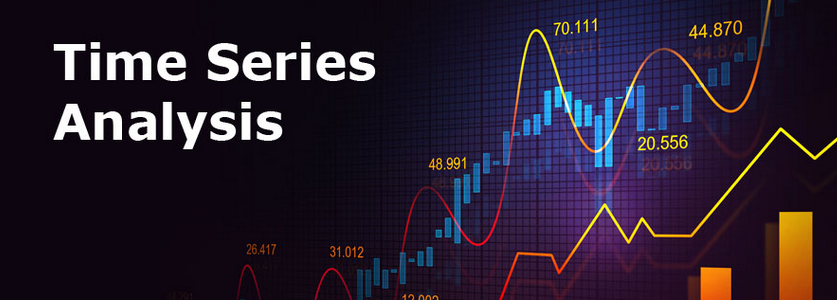

# Seasonality Decomposition Explorer
Apply HP filter for seasonality decomposition of time series stock prices.  

WebApp link:
 https://share.streamlit.io/erma0x/streamlit-trading-app/main/app.py 
 

## General Description

The Hodrick–Prescott filter is a mathematical tool used in macroeconomics, especially in real business cycle theory, to remove the cyclical component of a time series from raw data. It is used to obtain a smoothed-curve representation of a time series, one that is more sensitive to long-term than to short-term fluctuations.

Hodrick Prescott Filter does Time series decomposition which involves separating a time series into several distinct components(Cycle component and Trend Component).
And this filter looks like it can be applied to any time-series data especially with stock prices to understand the underlying trend and the cycle involved in it.

The HP filter is one of the most widely used tools in macroeconomic analysis. It tends to have favorable results if the noise is distributed normally, and when the analysis being conducted is historical.

According to a paper published by economist and professor James Hamilton—which appears on the National Bureau of Economic Research website—there are several reasons why the HP filter should not be used. Hamilton first proposes that the filer produces outcomes that have no basis in the process of generating data. He also states that the values that are filtered at the sample's end are totally different from those in the middle.

